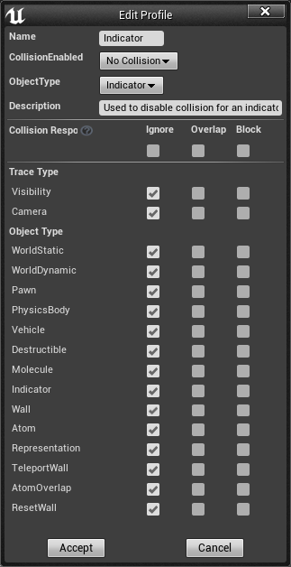

# Unreal Engine Molecular Dynamics Plugin
Last Edited: September 4th, 2021
Unreal Engine Version: 4.26.2

## Project Contributors
Shawn Ritter(KCVS), Dr. Robert MacDonald(KCVS), Ashley Elgersma(KCVS), Dr. Peter Mahaffy(KCVS), Jun Luo(UofT), Phillipe Patenaude(TFO), Eduardo Vasquez(TFO)

## Project Purpose
This plugin utilizes the Unreal engine as a framework for running a simplified Molecular Dynamics simulation. The eventual goal of this project is to create an open-source molecular dynamics simulation that can run in the engine in real time to be used for a variety of purposes. Our primary goal with developing this plugin is to create an MD simulation that can be viewed and interacted with in virtual reality. We are interested in studying how this tool, and virtual reality, might impact student engagement and understanding of undergraduate topics.

## Initial Set Up
As a plugin this project should be able to be added to, or loaded into any existing Unreal Engine Project as long as it has been created with the same engine version. Begin by navigating to your project folder, if you do not yet have a project please create a new C++ project. This will be referred to as `/Project`. Please close the Unreal engine and your code editor while performing this initial setup or when importing/cloning an updated release. Inside your `/Project` folder if there is not currently a `/Plugins` folder please create it. Navigate to `/Project/Plugins`. We will now clone a copy of the plugin from GitHub. Using your preferred git tool, please clone: `"https://github.com/SERitter/MolecularDynamicsPlugin.git"` into the `/Project/Plugins` directory. Once the clone has completed, there should now be a folder `\MolecularDynamicsPlugin` inside your `/Project/Plugins` directory. Please navigate back to the `/Project` directory and right-click on your .uproject file, select `Generate Visual Studio project files`. Once the process has completed, please open the .sln file. In your editor you now need to build your project solution. In visual studio when the .sln file is open please click `Build->Build Solution`. This build may take a few minutes. Once the build process has completed you can double click your .uproject file to launch the project.

Let's confirm the plugin is installed and ready to go. Please open `Edit->Plugins`. In the list of plugin types on the left scroll down to the bottom, the very last entry should be "Other". When you select this you should see the MolecularDynamicsPlugin listed and it should have the `Enabled` box checked. At this point we are going to attempt to drag an instance of the simulation cell into your map. 

**NOTE:** Currently if you load more than one copy of the simulation into your world the engine will crash, please only attempt to load one instance of the simulation into a level. 

To load a simulation into your level please open your `Content Browser` and expand the sources panel on the left (the Red circle in the picture). 

 Inside the sources, you should see two folders called `MolecularDynamicsPlugin Content` and `MolecularDynamics C++ Classes`. If you can't see these folder please select the `View Options` button on the bottom right of the content browser (highlighted with yellow in the picture). Make sure that `Show Plugin Content` is selected. 

 

 Navigate to `MolecularDynamicsPlugin Content/Blueprints`, inside this folder there should be a BP_Simulation actor. Please drag this into the world and position it wherever you like. In the editor panel there are a number of options for the simulation that have been exposed to make it easy for you to adjust some things on the simulation. Without getting into those yet, let's make sure the import worked properly, just leaving everything at default for the moment. Please click `Simulate` in the top toolbar. 

If everything is working correctly you should see a bunch of Water molecules inside a rather large cube.

Let's stop the simulation now. We need to set up some custom collisions before we can go any farther with the simulation.

## Custom Collision Configuration
Let's open `Edit->Project Settings`, on the left please select the Collision settings in the Engine section. 

In the Object Channels section we need to add several new object channels. The name is case-sensitive below and the default response is in the brackets.

    -Molecule (Block)
    -Indicator (Ignore)
    -Wall (Block)
    -Atom (Block)
    -Representation (Ignore)
    -TeleportWall (Overlap)
    -AtomOverlap (Overlap)
    -ResetWall (Overlap)

We don't need to do anything with trace channels, but we need to create collision presets for each of the Collision Channels that we created above. I will insert the settings for each Preset as images below. Please match the settings.

These might take a few minutes to set up, but they are important for the simulation to work and to behave as expected.Make sure the Name, CollisionEnabled, ObjectType and collision checkboxes all match. The description can be ignored, but the other values need to match. 

## Default Settings
There are a number of settings that have been exposed to the editor by default, they are in the picture below, and I will explain the purpose and limitations of each setting below. Virtually every one of these functions can also be accessed or called inside of blueprints so that you can customize and set up scripting with the simulation for your project. 

    - Solvent Name: This is the name of the molecule that you would like to use as your solvent for the simulation.  This adds a number of molecules to the simulation cell based upon the molecules density and the volume of the simulation cell. Adjust this before runtime. 
    
    - Current Solvent Modifier: This is used to adjust the number of molecules that are automatically inserted into the simulation cell at runtime. You can reduce or increase this number, but I would not recommend increasing it beyond 1. Adjust this before runtime. 

    -Teleport Walls: This allows you to toggle between either teleport walls or collision walls. Adjust this before runtime. 

    -Render Style: This allows you to choose what type of render style you want to use. 0-Hidden rendering, 1-linear rendering, 2-Ball and stick rendering, 3-Space-Filling rendering. Adjust this before runtime. 

    -Show Collision: Toggles visibility of the collision sphere object. Mostly for debugging. Adjust this before runtime. 

    -Add Solvent: Controls whether the solvent is added to the simulation cell. Adjust this before runtime. 

    -Show Co M: Controls visibility of the centre of mass indicator. Mostly for debuggin. Adjust this before runtime. 

    -Show Interaction Spheres: Controls visibility of the interaction spheres(Track and calculate intermolecular interaction/forces). Used for debugging. Adjust this before runtime. 

    -Show splines: Toggles visibility of the splines used to construct the bonds inside the molecule. For debugging. Adjust this before runtime.

    -Num Molecules: Allows you to specify a number of molecules to insert into the simulation cell. Adjust this before runtime.

    -Molecule Name: Similiar to the solvent Name above, this allows you to select the molecule that you would like to add to the simulation cell. Adjust this before runtime.

    -Spawn Num Molecules: Toggle to control if the specified number of your specified molecule should be added to the simulation cell. Adjust this before runtime.

    -**Simulation Active**: Used to start and stop the simulation during runtime. You can toggle this during runtime. 

    -Simulation Was Active: debugging, not usable.

    -**Temperature**: You can use this to adjust the temperature and the behaviour of the simulation during runtime. 

## Loading Molecules
You can load molecules into the simulation by adding molecule .pdb files into the `/Project/Plugins/MolecularDynamicsPlugin/Content/ChemData`. Then you would pass the name of the molecule into the Solvent or MoleculeName. Right now we are only working on water, so other things might not work very well. 

**NOTE:** We intend to allow you to scale the simulation, but I haven't tested to see if the latest changes might have broken things. 